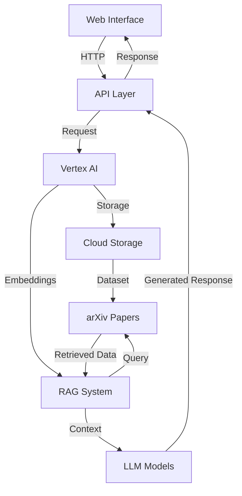

# InspireIt - an AI-Powered Research Assistant

InspireIt is a distributed research assistance platform created to revolutionize the academic research process. It leverages Google Cloud Platform's Vertex AI and Cloud Storage to provide intelligent research ideation and paper development capabilities.

See InspireIt documentation [link] for getting started, operational details, and other information.

## System Architecture

## Features

InspireIt offers comprehensive research assistance through multiple components:

### Intelligent Idea Generation
The platform excels at generating cross-domain research ideas by leveraging its RAG architecture powered by arXiv papers. It analyzes research opportunities, identifies potential drawbacks, and provides innovation potential scoring.

### Research Enhancement Tools
Users can access automated paper summaries, reference management, and citation suggestions. The system maintains standardized citation formats and performs cross-reference validation to ensure academic integrity.

### Interactive Development Pipeline
The platform provides step-by-step idea refinement with real-time feedback integration. Researchers can track their progress and compare different versions of their work as it develops.

## Getting Started

InspireIt provides three main entry points through its interface:

1. Get Started - Launches the idea generation pipeline
2. Analyze Now - Enables review of existing research ideas
3. Explore - Opens an AI-powered chat interface for research exploration

## Technology Stack

InspireIt is built on modern cloud infrastructure:

- Google Cloud Platform
  - Vertex AI for model serving and inference
  - Cloud Storage for data management
  - Agent Builder for conversation orchestration
- Mistral-large2 for natural language processing
- Vercel for deployment and hosting
- RAG architecture utilizing arXiv papers

## Target Audience

InspireIt serves various segments of the research community:

The platform is designed for academic researchers, including PhD students and faculty members, industry professionals in R&D, research institutions, and students engaged in academic writing and research projects.

## Get in Touch

Have questions, suggestions, bug reports? Reach out through:

- [Contact Email]
- [Project Discussion Forum]
- GitHub Issues

## Contributing

See [CONTRIBUTING](./CONTRIBUTING.md).

## License

[Your License] License

## Sponsors

InspireIt is powered by Google Cloud Platform and deployed on Vercel. We appreciate their infrastructure support in making this project possible.
